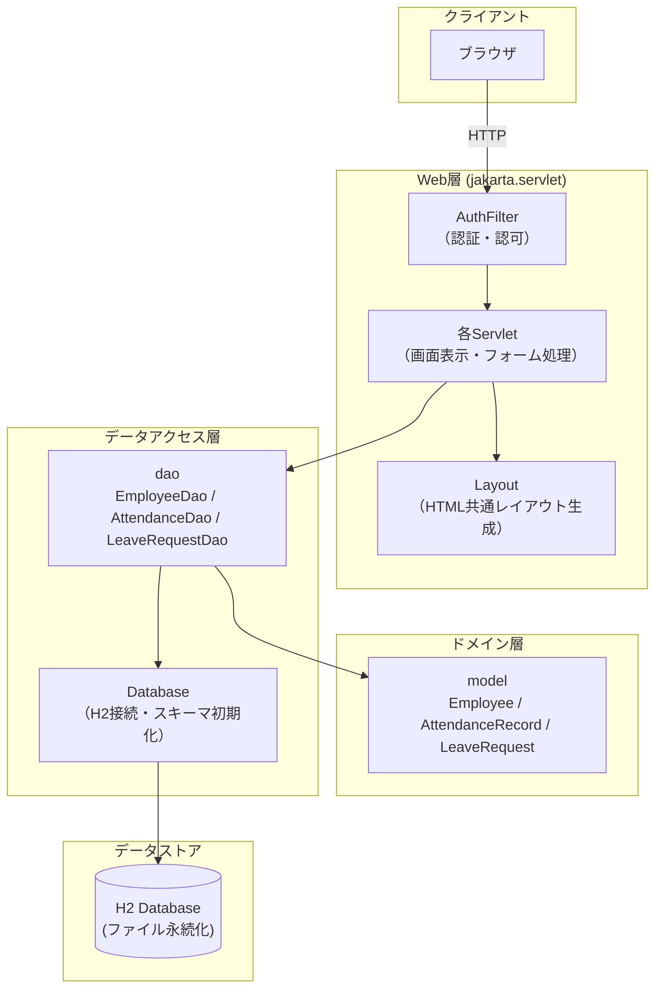

# 基本設計書

## 1. システム概要

| 項目 | 内容 |
|---|---|
| システム名 | Sunrise Industries 勤怠管理システム |
| 対象クライアント（想定） | 株式会社サンライズ工業（従業員150名規模の製造業） |
| 目的 | 紙・Excelで行っていた出退勤管理と有給申請を電子化し、集計ミス・申請紛失をなくす |
| 利用者 | 一般社員（出退勤打刻・有給申請）、管理者（チーム勤怠確認・有給承認・CSV出力） |
| システム形態 | 社内向けWebアプリケーション（イントラネット想定） |

背景・技術選定の理由は [README](../README.md) を参照。

## 2. 機能一覧

| No | 機能名 | 概要 | 対象ロール |
|---|---|---|---|
| F01 | ログイン／ログアウト | 社員コード＋パスワードによる認証 | 全員 |
| F02 | 出退勤打刻 | 当日の出勤・退勤時刻を記録 | 社員 |
| F03 | 当月勤怠一覧・残業集計 | 自分の当月の勤怠実績と残業時間を確認 | 社員 |
| F04 | 有給申請 | 開始日・終了日・理由を指定して申請 | 社員 |
| F05 | チーム勤怠ダッシュボード | 配下社員の本日の出退勤状況を一覧表示 | 管理者 |
| F06 | 有給申請の承認／却下 | 承認待ちの有給申請を判断 | 管理者 |
| F07 | 勤怠CSV出力 | 当月の全社員勤怠実績をCSVでダウンロード | 管理者 |
| F08 | アクセス制御 | 未ログイン時のログイン画面誘導、権限外操作の403拒否 | 全員（共通機能） |

## 3. 画面一覧

| 画面ID | 画面名 | URL | ロール制限 |
|---|---|---|---|
| S01 | ログイン画面 | `/login` | 未ログインのみアクセス可 |
| S02 | ダッシュボード | `/dashboard` | ログイン済み（ロールにより表示内容分岐） |
| S03 | 勤怠一覧画面 | `/attendance` | ログイン済み |
| S04 | 有給申請画面 | `/leave/request` | 社員 |
| S05 | 有給承認画面 | `/leave/approve` | 管理者のみ |

画面遷移の詳細は [03_画面遷移図.md](./03_画面遷移図.md) を参照。

## 4. アーキテクチャ概要

レイヤードアーキテクチャ（DIコンテナなし・Servlet同士がコンストラクタでDAOを直接生成する素朴な構成）。

## 5. 使用技術

[README](../README.md) の「使用技術」を参照。フレームワークを使わずServlet API + JDBCの素の組み合わせで実装している点が本システムの技術的な特徴。

## 6. 関連ドキュメント

- [02_ER図.md](./02_ER図.md)：テーブル定義とリレーション
- [03_画面遷移図.md](./03_画面遷移図.md)：画面遷移
- [04_シーケンス図.md](./04_シーケンス図.md)：主要処理フロー
- [05_非機能要件.md](./05_非機能要件.md)：非機能要件一覧
