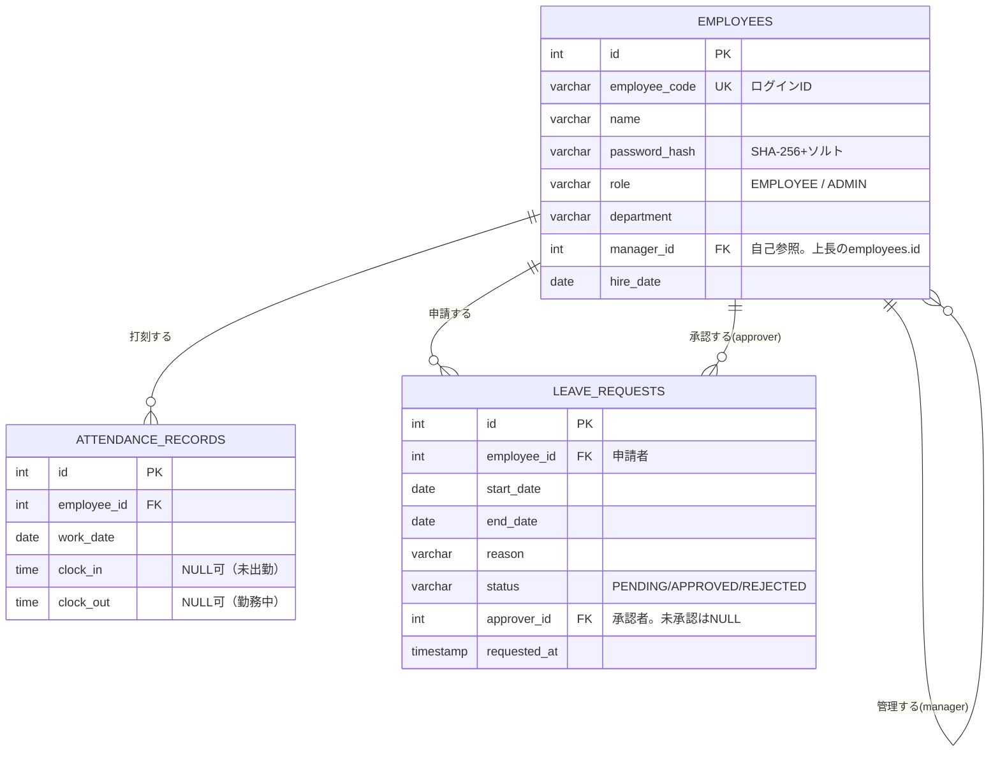

# ER図

対象：`Database.initialize()` で定義されている3テーブル（`com.sunrise.attendance.dao.Database`）。

## ER図（Mermaid）

## テーブル定義補足

### employees（社員マスタ）

| カラム | 型 | 制約 | 備考 |
|---|---|---|---|
| id | INT | PK, AUTO_INCREMENT | |
| employee_code | VARCHAR(20) | UNIQUE, NOT NULL | ログインIDとして使用 |
| name | VARCHAR(50) | NOT NULL | |
| password_hash | VARCHAR(200) | NOT NULL | `PasswordUtil`でハッシュ化（現状SHA-256+ソルト、将来BCrypt化を検討） |
| role | VARCHAR(10) | NOT NULL | `EMPLOYEE` \| `ADMIN` |
| department | VARCHAR(50) | NOT NULL | |
| manager_id | INT | NULL可, 自己参照FK | 上長の`id`。現行実装では未参照（将来の部署別承認権限拡張で使用想定） |
| hire_date | DATE | NOT NULL | |

### attendance_records（勤怠実績）

| カラム | 型 | 制約 | 備考 |
|---|---|---|---|
| id | INT | PK, AUTO_INCREMENT | |
| employee_id | INT | NOT NULL, FK → employees.id | |
| work_date | DATE | NOT NULL | |
| clock_in | TIME | NULL可 | |
| clock_out | TIME | NULL可 | |
| （複合UNIQUE） | | `UNIQUE(employee_id, work_date)` | 1人1日1レコードを保証 |

残業時間は物理カラムを持たず、`AttendanceRecord#getOvertimeMinutes()`で都度算出（1日8時間超過分）。

### leave_requests（有給申請）

| カラム | 型 | 制約 | 備考 |
|---|---|---|---|
| id | INT | PK, AUTO_INCREMENT | |
| employee_id | INT | NOT NULL, FK → employees.id | 申請者 |
| start_date | DATE | NOT NULL | |
| end_date | DATE | NOT NULL | |
| reason | VARCHAR(200) | NULL可 | |
| status | VARCHAR(10) | NOT NULL, DEFAULT 'PENDING' | `PENDING` \| `APPROVED` \| `REJECTED` |
| approver_id | INT | NULL可, FK → employees.id | 承認者。未処理時はNULL |
| requested_at | TIMESTAMP | NOT NULL | |

## 現行実装での制約（設計上あえて簡略化した範囲）

- 外部キー制約はDBスキーマ上は宣言されていない（アプリケーション側で整合性を担保する前提）。本番運用ではFK制約・ON DELETE方針の明示が必要。
- `manager_id`は現状データ投入のみでロジック未使用（README「今後の拡張候補」の部署別承認権限で活用予定）。
