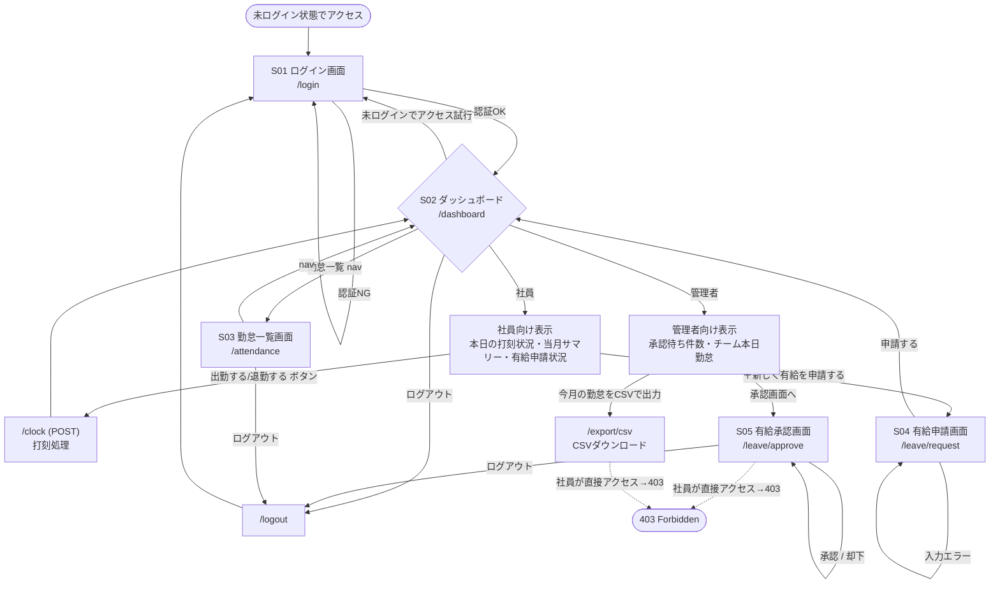

# 画面遷移図

`Main.java`のルーティング定義と`AuthFilter`のアクセス制御に基づく画面遷移。

## 補足

- `/leave/approve` と `/export/csv` は`AuthFilter`の`ADMIN_ONLY_PATHS`により管理者以外は403。
- `/login`・`/`・`/static/style.css`のみ未ログインでアクセス可能（`PUBLIC_PATHS`）。それ以外は未ログインなら`/login`へ強制リダイレクト。
- ヘッダーナビゲーション（`Layout.navFor`）は「ダッシュボード」「勤怠一覧」が共通表示、「承認待ち一覧」は管理者のみ表示。
