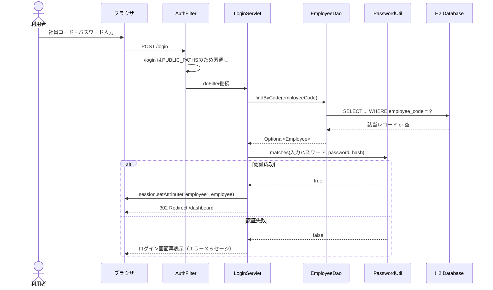
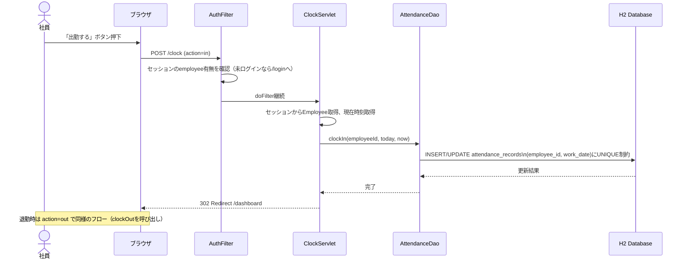
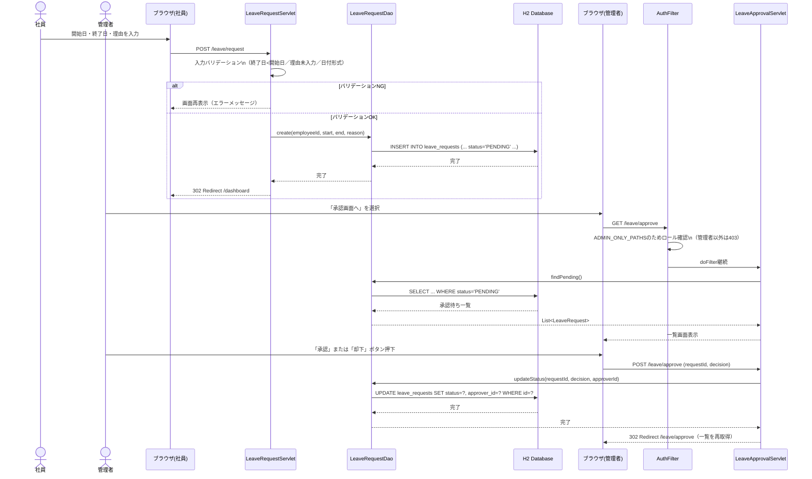
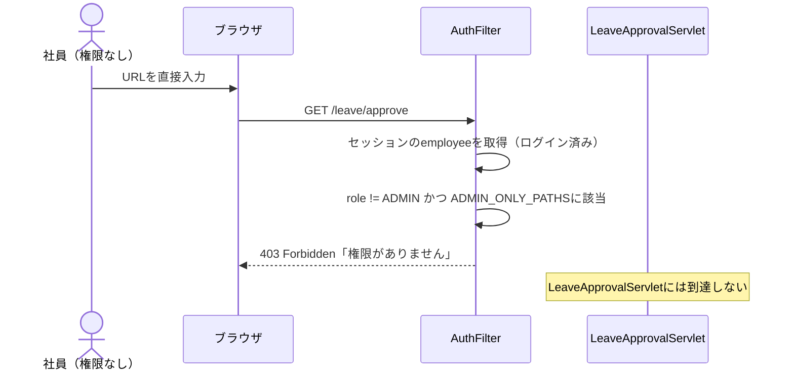

# シーケンス図

主要な業務フローについて、実装（Servlet/Filter/DAO）に忠実な形でシーケンス図を示す。

## 1. ログイン処理

```mermaid
sequenceDiagram
    actor U as 利用者
    participant B as ブラウザ
    participant F as AuthFilter
    participant L as LoginServlet
    participant D as EmployeeDao
    participant P as PasswordUtil
    participant DB as H2 Database

    U->>B: 社員コード・パスワード入力
    B->>F: POST /login
    F->>F: /login はPUBLIC_PATHSのため素通し
    F->>L: doFilter継続
    L->>D: findByCode(employeeCode)
    D->>DB: SELECT ... WHERE employee_code = ?
    DB-->>D: 該当レコード or 空
    D-->>L: Optional<Employee>
    L->>P: matches(入力パスワード, password_hash)
    alt 認証成功
        P-->>L: true
        L->>B: session.setAttribute("employee", employee)
        L-->>B: 302 Redirect /dashboard
    else 認証失敗
        P-->>L: false
        L-->>B: ログイン画面再表示（エラーメッセージ）
    end
```

## 2. 出退勤打刻

```mermaid
sequenceDiagram
    actor U as 社員
    participant B as ブラウザ
    participant F as AuthFilter
    participant C as ClockServlet
    participant AD as AttendanceDao
    participant DB as H2 Database

    U->>B: 「出勤する」ボタン押下
    B->>F: POST /clock (action=in)
    F->>F: セッションのemployee有無を確認（未ログインなら/loginへ）
    F->>C: doFilter継続
    C->>C: セッションからEmployee取得、現在時刻取得
    C->>AD: clockIn(employeeId, today, now)
    AD->>DB: INSERT/UPDATE attendance_records\n(employee_id, work_date)にUNIQUE制約
    DB-->>AD: 更新結果
    AD-->>C: 完了
    C-->>B: 302 Redirect /dashboard

    Note over U,B: 退勤時は action=out で同様のフロー（clockOutを呼び出し）
```

## 3. 有給申請〜承認

```mermaid
sequenceDiagram
    actor E as 社員
    actor A as 管理者
    participant B1 as ブラウザ(社員)
    participant LR as LeaveRequestServlet
    participant LD as LeaveRequestDao
    participant DB as H2 Database
    participant B2 as ブラウザ(管理者)
    participant F as AuthFilter
    participant LA as LeaveApprovalServlet

    E->>B1: 開始日・終了日・理由を入力
    B1->>LR: POST /leave/request
    LR->>LR: 入力バリデーション\n（終了日<開始日／理由未入力／日付形式）
    alt バリデーションNG
        LR-->>B1: 画面再表示（エラーメッセージ）
    else バリデーションOK
        LR->>LD: create(employeeId, start, end, reason)
        LD->>DB: INSERT INTO leave_requests (... status='PENDING' ...)
        DB-->>LD: 完了
        LD-->>LR: 完了
        LR-->>B1: 302 Redirect /dashboard
    end

    A->>B2: 「承認画面へ」を選択
    B2->>F: GET /leave/approve
    F->>F: ADMIN_ONLY_PATHSのためロール確認\n（管理者以外は403）
    F->>LA: doFilter継続
    LA->>LD: findPending()
    LD->>DB: SELECT ... WHERE status='PENDING'
    DB-->>LD: 承認待ち一覧
    LD-->>LA: List<LeaveRequest>
    LA-->>B2: 一覧画面表示

    A->>B2: 「承認」または「却下」ボタン押下
    B2->>LA: POST /leave/approve (requestId, decision)
    LA->>LD: updateStatus(requestId, decision, approverId)
    LD->>DB: UPDATE leave_requests SET status=?, approver_id=? WHERE id=?
    DB-->>LD: 完了
    LD-->>LA: 完了
    LA-->>B2: 302 Redirect /leave/approve（一覧を再取得）
```

## 4. 権限外アクセスの拒否（例：社員が承認画面へ直接アクセス）

```mermaid
sequenceDiagram
    actor E as 社員（権限なし）
    participant B as ブラウザ
    participant F as AuthFilter
    participant LA as LeaveApprovalServlet

    E->>B: URLを直接入力
    B->>F: GET /leave/approve
    F->>F: セッションのemployeeを取得（ログイン済み）
    F->>F: role != ADMIN かつ ADMIN_ONLY_PATHSに該当
    F-->>B: 403 Forbidden「権限がありません」
    Note over LA: LeaveApprovalServletには到達しない
```
